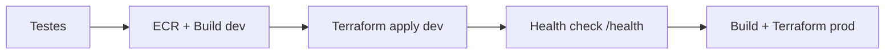

# Solução do desafio CI/CD (GitHub Actions + AWS App Runner + Terraform)

Pipeline de **integração e entrega contínua** para uma API Node.js containerizada no **AWS App Runner**, com infraestrutura **dev** e **prod** provisionada por **Terraform** modular.

## O que este repositório entrega

| Etapa do desafio | Implementação |
|------------------|---------------|
| Repositório / README / licença / `.gitignore` | Este diretório + [LICENSE](./LICENSE) (MIT) |
| Pipeline CI/CD | [`.github/workflows/ci-cd.yml`](./.github/workflows/ci-cd.yml) |
| Terraform modular (dev + prod) | [`terraform/modules/apprunner`](./terraform/modules/apprunner) + [`terraform/environments/*`](./terraform/environments/) |
| Deploy automático em **dev** após testes e build | Job `deploy-dev` |
| Health check em **dev** antes de **prod** | Job `health-check-dev` → `deploy-prod` |
| Deploy em **prod** após validação | Job `deploy-prod` (depende do health check) |

## Estrutura

```
ci-cd-challenge/
  app/                          # API Node (porta 3000, /health)
  terraform/
    modules/apprunner/           # ECR, IAM, App Runner
    environments/dev|prod/      # roots por ambiente
  .github/workflows/ci-cd.yml
  scripts/health-check.sh
  docs/PIPELINE.md
  README.md
```

## Fluxo da pipeline (branch `main`)



Detalhes: [docs/PIPELINE.md](./docs/PIPELINE.md).

## Pré-requisitos

- Conta **AWS** com permissões para ECR, App Runner, IAM e (opcional) Terraform state em S3
- **GitHub** com Actions habilitado
- **OIDC** configurado entre GitHub e AWS (recomendado) ou chaves de acesso em secrets
- Terraform ≥ 1.3, Docker, Node 20 (local)

## Configuração no GitHub

### Secrets (Settings → Secrets and variables → Actions)

| Secret | Descrição |
|--------|-----------|
| `AWS_ROLE_ARN` | ARN da role IAM assumida via OIDC (`sts:AssumeRoleWithWebIdentity`) |
| `AWS_REGION` | Região (ex.: `us-east-1`) |

### Environments (opcional, recomendado)

Crie os environments **`development`** e **`production`** no repositório para aprovações e secrets por ambiente.

### Monorepo `rocketseat-cloud`

O workflow usa caminhos `challenges/ci-cd/ci-cd-challenge/...`. Se você publicar **somente** esta pasta como repositório raiz, ajuste no workflow:

- `APP_DIR` → `app`
- `TF_DIR_DEV` → `terraform/environments/dev`
- `TF_DIR_PROD` → `terraform/environments/prod`
- Remova o prefixo `challenges/ci-cd/ci-cd-challenge/` dos `paths` do `on.push`

## Desenvolvimento local

```bash
cd app
npm test
APP_ENV=local PORT=3000 npm start
curl http://localhost:3000/health
```

Build da imagem:

```bash
docker build -t ci-cd-challenge:local app
docker run --rm -p 3000:3000 -e APP_ENV=local ci-cd-challenge:local
```

## Terraform (manual)

```bash
cd terraform/environments/dev
cp terraform.tfvars.example terraform.tfvars   # ajuste se necessário
terraform init
terraform plan -var="image_uri=<sua-imagem-ecr>"
terraform apply -var="image_uri=<sua-imagem-ecr>"
```

Variáveis de ambiente da aplicação (não sensíveis) estão em `runtime_environment_variables` no módulo. Para **API keys** ou senhas, use `runtime_environment_secrets` no módulo (mapa `nome => ARN` do Secrets Manager) — não commite valores no `.tfvars`.

## Primeira execução na AWS

1. Configure secrets `AWS_ROLE_ARN` e `AWS_REGION` no GitHub.
2. Faça push na branch `main` (ou dispare `workflow_dispatch`).
3. A pipeline cria o **ECR** (`-target=module.apprunner.aws_ecr_repository.app`), publica a imagem e aplica o App Runner com a tag do commit.
4. O job **health-check-dev** só libera **prod** se `GET /health` retornar `{"status":"ok",...}`.

## Contribuindo

1. Fork / branch a partir de `main`
2. Alterações em `app/` disparam testes no PR (`terraform-plan` em dev e prod)
3. Merge em `main` executa deploy dev → health → prod

## Licença

[MIT](./LICENSE) — uso livre com atribuição; ajuste conforme a política da sua organização.
