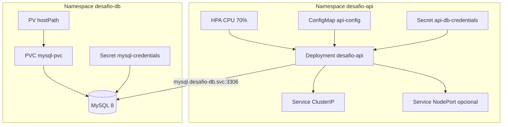

# Solução do desafio Kubernetes — API + MySQL

Implementação completa do [desafio](../challenge.md): cluster local (**Kind**), namespaces isolados, **Deployments**, **Services**, **PV/PVC**, **ConfigMap/Secret**, **probes**, **HPA** com **Metrics Server**, API Node.js integrada ao **MySQL** e documentação de observabilidade.

## Arquitetura



## Estrutura do repositório

```
kubernetes-challenge-solution/
  app/                    # API Node.js (porta 3000)
  cluster/
    kind-config.yaml
    metrics-server.yaml
  k8s/
    00-namespaces.yaml      # desafio-api, desafio-db
    db/                     # MySQL + PV/PVC + Secret
    api/                    # API + HPA + Services
  scripts/
    setup-kind.sh
    build-image.sh
    apply-all.sh
    test-api.sh
    load-test-hpa.sh
  README.md
```

## Requisitos atendidos

| Requisito do desafio | Arquivo / recurso |
|----------------------|-------------------|
| Namespaces `desafio-api` e `desafio-db` | `k8s/00-namespaces.yaml` |
| Deployment API com probes | `k8s/api/deployment.yaml` (`/healthz`, `/readyz`) |
| Deployment DB + Secret | `k8s/db/deployment.yaml`, `k8s/db/secret.yaml` |
| Services ClusterIP | `k8s/api/service.yaml`, `k8s/db/service.yaml` |
| PV + PVC | `k8s/db/pv.yaml`, `k8s/db/pvc.yaml`, `k8s/db/storageclass.yaml` |
| ConfigMap + Secret (conexão) | `k8s/api/configmap.yaml`, `k8s/api/secret.yaml` |
| HPA CPU 50–80% | `k8s/api/hpa.yaml` (alvo **70%**) |
| Metrics Server | `cluster/metrics-server.yaml` |
| GET `/status`, POST `/dados` | `app/src/server.js` |
| GET `/dados` (listagem — extra) | `app/src/server.js` |
| NodePort (extra) | `k8s/api/service-nodeport.yaml` |
| Rolling Update API | `deployment.yaml` `strategy: RollingUpdate` |

## Endpoints da API

| Método | Rota | Uso |
|--------|------|-----|
| GET | `/status` | Testa MySQL — retorna `{"message":"Conexão OK"}` |
| POST | `/dados` | Insere JSON no banco |
| GET | `/dados` | Lista registros persistidos |
| GET | `/healthz` | **Liveness** probe |
| GET | `/readyz` | **Readiness** probe (depende do banco) |

## Pré-requisitos

- [Docker](https://docs.docker.com/)
- [kubectl](https://kubernetes.io/docs/tasks/tools/)
- [Kind](https://kind.sigs.k8s.io/) **ou** Minikube
- `curl`, `bash`

## Passo a passo (Kind)

### 1. Subir o cluster e Metrics Server

```bash
cd challenges/kubernetes/kubernetes-challenge-solution
./scripts/setup-kind.sh
```

### 2. Build da imagem e carga no Kind

```bash
./scripts/build-image.sh
```

### 3. Aplicar manifestos

```bash
./scripts/apply-all.sh
```

Para expor via **NodePort** (desafio adicional):

```bash
APPLY_NODEPORT=1 ./scripts/apply-all.sh
# ou depois: kubectl apply -f k8s/api/service-nodeport.yaml
```

### 4. Testar integração

```bash
./scripts/test-api.sh
# NodePort: ./scripts/test-api.sh nodeport
```

### 5. Observabilidade

```bash
# Logs
kubectl logs -n desafio-api -l app=desafio-api -f
kubectl logs -n desafio-db -l app=mysql -f

# Métricas (Metrics Server)
kubectl top pods -n desafio-api
kubectl top pods -n desafio-db

# Status
kubectl get pods,svc,pvc,hpa -A | grep desafio
```

### 6. Validar HPA sob carga

```bash
./scripts/load-test-hpa.sh
# Em outro terminal:
kubectl get hpa -n desafio-api -w
kubectl get pods -n desafio-api -w
```

## Minikube (alternativa)

```bash
minikube start
minikube addons enable metrics-server
eval $(minikube docker-env)
./scripts/build-image.sh   # imagem no daemon do Minikube
```

Se o PV `hostPath` não encaixar, use apenas PVC dinâmico: remova `volumeName` e `storageClassName` customizado de `k8s/db/pvc.yaml` e não aplique `pv.yaml` / `storageclass.yaml`.

## Credenciais (altere em produção)

Valores padrão em `k8s/db/secret.yaml` e `k8s/api/secret.yaml`:

| Variável | Valor exemplo |
|----------|----------------|
| `MYSQL_USER` / `DB_USER` | `app_user` |
| `MYSQL_PASSWORD` / `DB_PASSWORD` | `app-changeme` |
| `MYSQL_DATABASE` / `DB_DATABASE` | `desafio_db` |

A API usa apenas o usuário `app_user` (sem privilégios de root), atendendo o extra de permissão mínima no banco.

## Desenvolvimento local da API

```bash
cd app
npm install
# Suba um MySQL local e exporte DB_HOST, DB_USER, DB_PASSWORD, DB_DATABASE
npm start
curl http://localhost:3000/status
```

## Comandos úteis

```bash
# Reiniciar API com nova imagem
./scripts/build-image.sh
kubectl rollout restart deployment/desafio-api -n desafio-api

# Port-forward
kubectl port-forward -n desafio-api svc/desafio-api 8080:80

# Destruir cluster Kind
kind delete cluster --name desafio-k8s
```

## Contribuindo

1. Fork / branch
2. Ajuste manifestos ou `app/`
3. Teste com `./scripts/apply-all.sh` e `./scripts/test-api.sh`
4. Abra PR descrevendo mudanças em recursos Kubernetes

## Licença

Uso educacional Rocketseat — ajuste conforme sua necessidade.
